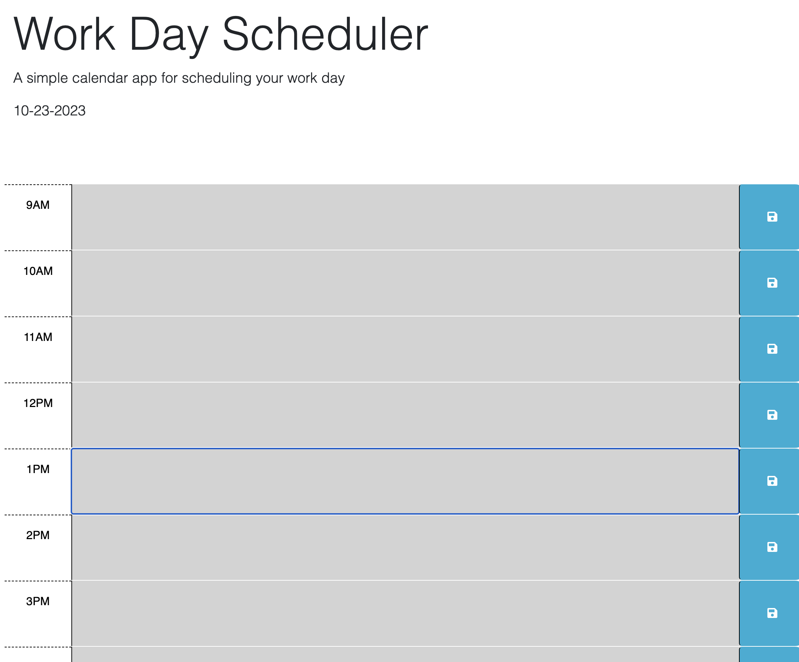

## Description

The following application allows the user to add text content between the times of 9:00 AM - 5:00 PM. The user has the ability to save their text content and load the data from the local storage automatically upon next start up. The application will color-code the time blocks depending on whether the event is in the past, present, or future.

## Usage

## Credits

Richard Song - https://www.linkedin.com/in/song-richard/
UCB Starter Code

## Link to GitHub Repository

https://github.com/song-richard/workDayScheduler

## Link to Deployed Application

https://song-richard.github.io/workDayScheduler/